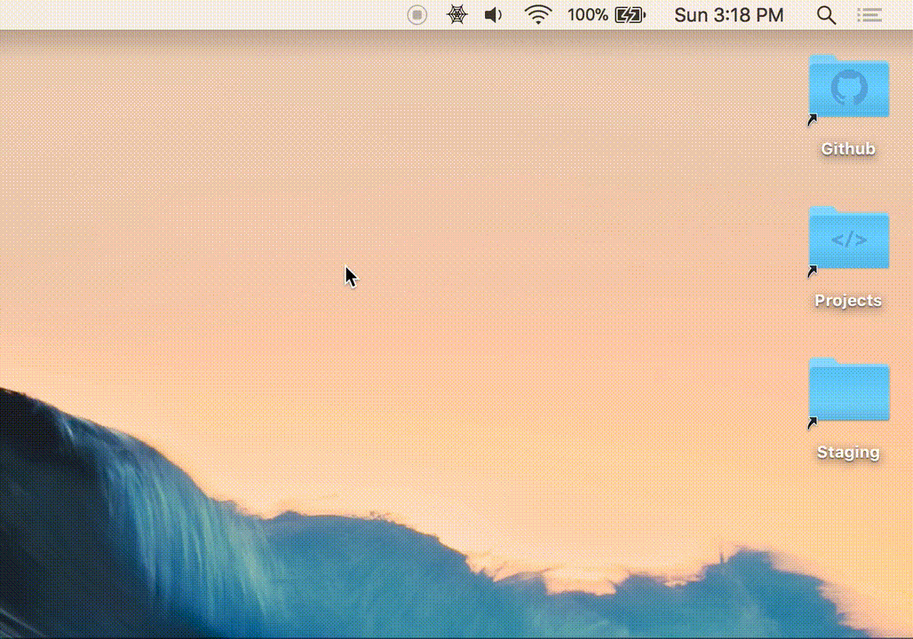

# Bitsy
> Lightweight clipboard manager for MacOS


</br></br>
<p align="center" ></p>
</br></br>

## Building & Running

This project uses maven as it's build system. If you would like to build and run the application from source, then the following commands will prove useful. Please note that the application version is replaced with **x.x.x** for the sake of maintainability of this _README_ document.

##### Package JAR
This will produce a _jar_ file in the _target_ directory.
```
mvn package
```

##### Bundle APP
This will bundle the project _jar_ into an app that can be found here: _target/bitsy-x.x.x/bitsy.app_
```
mvn package appbundle:bundle
```

##### Run JAR
This will run the produced _jar_ file, please note that you can also run the _app_ by simply clicking it.
```
java -cp target/bitsy-x.x.x.jar io.raffi.bitsy.Application
```
